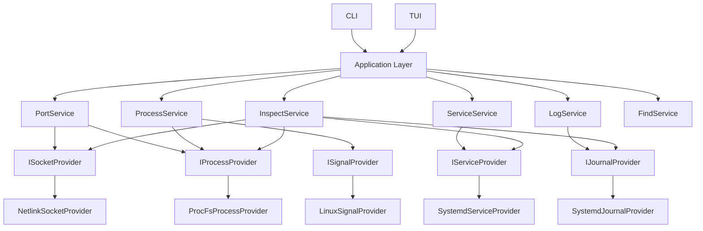

# LX — Linux Resource Manager
## C++17 项目总体设计与开发规范

> **项目状态**：设计阶段  
> **暂定命令名**：`lx`  
> **语言标准**：C++17  
> **目标平台**：Linux  
> **首要服务管理后端**：systemd  
> **文档用途**：本文件是项目的产品需求、总体架构、编码约束、测试策略、调试方案、部署方案和 AI 开发规范的统一依据。后续使用 AI 辅助开发时，应优先遵循本文档，不应为了快速实现而破坏本文定义的架构边界。

---

# 1. 项目愿景

Linux 本地运维存在一个长期问题：用户真正关心的是“资源”，但传统操作方式要求用户记住大量彼此割裂的命令。

例如，当用户发现 `8080` 端口被占用时，传统排查路径可能涉及：

- 查询监听端口；
- 获取 socket 信息；
- 找到对应 PID；
- 查询进程；
- 判断进程是否由 systemd 管理；
- 查看服务状态；
- 查看日志；
- 决定停止服务还是终止进程。

这些能力通常散落在不同工具中。

LX 的目标不是把这些命令包装成别名，而是建立一个统一的 Linux 资源管理模型：

```text
User
 │
 │  "我关心 8080"
 ▼
LX
 │
 ├── Socket
 │    └── Process
 │          └── Service
 │                └── Journal
 │
 └── 给出统一、可解释、可操作的结果
```

核心设计思想：

> **User thinks in resources, not commands.**  
> 用户思考的是端口、进程、服务、日志，而不是“应该使用哪个 Linux 命令”。

---

# 2. 项目定位

LX 是一个面向 Linux 本机资源的：

- CLI 管理工具；
- TUI 管理工具；
- 资源关联分析器；
- 轻量级故障诊断工具。

第一阶段重点替代以下类别的日常操作：

| 资源 | LX 能力 |
|---|---|
| Port / Socket | 查询监听端口、连接、协议、地址、UID、对应进程 |
| Process | 查询 PID、PPID、用户、命令、可执行文件、内存、线程等 |
| Service | 查询、启动、停止、重启、reload、enable、disable |
| Journal | 查询服务日志、按时间过滤、实时跟踪 |
| Relationship | Port → Socket → PID → Process → Service → Journal |
| Diagnose | 对权限不足、服务启动失败、端口冲突等提供解释 |

后续版本再扩展：

- CPU；
- Memory；
- Disk；
- Mount；
- Network Interface；
- DNS；
- Firewall；
- Container；
- User；
- Cron / Timer；
- File usage；
- cgroup；
- Namespace；
- System health。

---

# 3. 非目标

以下内容 **不是第一阶段目标**：

1. 不做远程 SSH 管理平台；
2. 不做 Web 管理后台；
3. 不做长期驻留监控 Agent；
4. 不做 Prometheus 替代品；
5. 不做 Kubernetes 管理器；
6. 不追求替代 Linux 中所有系统工具；
7. 不通过 `system()`、`popen()` 调用现有命令完成核心功能；
8. 不在 v1 中自行实现完整 init system；
9. 不要求非 systemd 系统一开始就拥有完整 Service 功能。

---

# 4. 最高优先级架构原则

## 4.1 禁止 Shell 套壳

生产代码中的核心功能禁止依赖：

```cpp
system(...)
popen(...)
```

也禁止通过：

```text
/bin/sh
/bin/bash
ss
lsof
ps
kill
systemctl
journalctl
netstat
fuser
```

完成实际资源查询或操作。

例如以下实现是禁止的：

```cpp
std::system("systemctl restart nginx");
```

```cpp
FILE* fp = popen("ss -lntp", "r");
```

```cpp
std::string cmd = "kill -9 " + std::to_string(pid);
std::system(cmd.c_str());
```

LX 应直接使用：

```text
Linux Kernel API
/proc
Netlink / SOCK_DIAG
kill(2)
pidfd APIs（可用时）
D-Bus / sd-bus
sd-journal
```

这样可以：

- 不依赖命令输出文本格式；
- 不受 locale 影响；
- 避免 shell injection；
- 获得结构化数据；
- 更容易测试；
- 更容易输出 JSON；
- 更容易进行错误分类；
- 提高项目技术价值。

---

## 4.2 Core 不依赖 UI

必须保证：

```text
CLI ─┐
     ├── Application/Core
TUI ─┘
```

而不能：

```text
CLI → /proc
CLI → Netlink
TUI → D-Bus
```

CLI 和 TUI 只负责：

- 获取用户输入；
- 调用 Application Service；
- 展示结果；
- 请求确认。

Linux 细节必须封装在 Adapter / Provider 层。

---

## 4.3 Domain Model 与 Linux API 解耦

例如：

```cpp
struct ProcessInfo;
struct SocketInfo;
struct ServiceInfo;
struct JournalEntry;
```

不应该直接暴露：

```text
nlmsghdr*
sd_bus_message*
sd_journal*
FILE*
```

到 Core 层。

所有底层资源应使用 RAII 封装。

---

## 4.4 查询允许 Partial Result

系统管理工具必须接受现实：

- 进程可能刚查询完就退出；
- `/proc/<pid>` 可能瞬间消失；
- 当前用户可能没有权限读取某些 `/proc/<pid>/fd`；
- systemd 不一定运行；
- D-Bus 可能不可用；
- journal 可能不可读；
- container / namespace 中只能看到部分资源。

因此：

> “无法读取一小部分信息”不应导致整个查询失败。

例如：

```text
Port 8080
  State       LISTEN
  Process     java
  PID         1234
  Executable  <permission denied>
  Service     demo.service
```

应该仍然返回 Port 和 PID。

---

# 5. 平台与兼容性目标

## 5.1 Linux 发行版

第一阶段重点支持：

- Rocky Linux 8 / 9；
- RHEL 8 / 9；
- AlmaLinux 8 / 9；
- Ubuntu LTS；
- Debian stable。

要求：

- x86_64 第一优先；
- aarch64 架构设计上不得阻塞；
- little-endian 假设不得散落在业务代码中。

---

## 5.2 systemd

如果系统运行 systemd：

```text
ServiceProvider = SystemdServiceProvider
JournalProvider = SystemdJournalProvider
```

如果没有 systemd：

```text
Port       可用
Process    可用
Service    unavailable
Journal    unavailable 或降级
```

例如 WSL 未启用 systemd 时，LX 不应该整体无法启动。

应该显示：

```text
$ lx doctor

Process API       OK
Socket API        OK
systemd           unavailable
Journal           unavailable

Reason:
  systemd is not running as the system service manager.

Available features:
  port
  process
  inspect process/socket
```

---

## 5.3 新内核增强能力

不能把新内核 API 作为 Rocky 8 等环境的硬性前提。

例如：

```text
pidfd_open()
pidfd_send_signal()
```

应作为增强路径。

设计：

```text
if pidfd supported:
    pidfd_open
    pidfd_send_signal
else:
    kill(2)
```

必须进行运行时能力检测，而不是只依赖编译时判断。

---

# 6. CLI 产品设计

## 6.1 基本命令

```bash
lx
lx --help
lx --version
lx doctor
```

资源命令：

```bash
lx port
lx process
lx service
lx log
lx inspect
lx find
lx status
```

---

# 7. Port 命令

## 7.1 查看所有监听端口

```bash
lx port
```

默认输出：

```text
PROTO  ADDRESS          PORT   PROCESS     PID     SERVICE
TCP    0.0.0.0          22     sshd        913     sshd.service
TCP    0.0.0.0          80     nginx       1624    nginx.service
TCP    0.0.0.0          443    nginx       1624    nginx.service
TCP    127.0.0.1        8080   java        9273    demo.service
```

---

## 7.2 查询指定端口

```bash
lx port 8080
```

输出：

```text
Port 8080 / TCP
────────────────────────────────────────
State       LISTEN
Address     127.0.0.1
UID         1000

Process
  PID         9273
  Name        java
  User        jackson
  Executable  /usr/bin/java
  Command     java -jar /opt/demo/app.jar

Service
  Unit        demo.service
  State       active
  Enabled     enabled

Recent logs
  14:02:13  Application started
  14:02:13  Listening on 127.0.0.1:8080
```

---

## 7.3 释放端口

```bash
lx port free 8080
```

行为：

### 如果属于 systemd service

```text
Port 8080 is owned by PID 9273.
PID 9273 belongs to demo.service.

Recommended action:
  Stop demo.service instead of killing PID 9273.

Stop service? [Y/n]
```

### 如果普通进程

```text
Port 8080 is owned by:

  PID      19273
  Process  python3
  Command  python3 server.py

Send SIGTERM? [Y/n]
```

如果正常退出失败：

```text
Process is still running.

Force termination with SIGKILL? [y/N]
```

危险动作支持：

```bash
lx port free 8080 --yes
```

但默认必须确认。

---

# 8. Process 命令

## 8.1 进程列表

```bash
lx process
```

支持：

```bash
lx process --user jackson
lx process --name nginx
lx process --service nginx.service
```

---

## 8.2 进程详情

```bash
lx process 9273
```

输出：

```text
Process 9273
──────────────────────────────────
Name        java
State       sleeping
PPID        1
User        jackson
Threads     23
RSS         412 MiB
Executable  /usr/bin/java
CWD         /opt/demo

Command
  java -jar app.jar

Service
  demo.service

Sockets
  TCP 127.0.0.1:8080 LISTEN
```

---

## 8.3 停止进程

```bash
lx process stop 9273
```

默认：

```text
SIGTERM
```

强制：

```bash
lx process kill 9273
```

默认：

```text
SIGKILL
```

必须拒绝危险目标：

```text
PID 1
LX 自己
无效 PID
已经退出的进程
```

---

# 9. Service 命令

```bash
lx service
lx service nginx
lx service nginx start
lx service nginx stop
lx service nginx restart
lx service nginx reload
lx service nginx enable
lx service nginx disable
```

允许：

```bash
lx svc nginx
```

作为 `service` 的短别名。

不要增加大量难记单字母 flag。

---

## 9.1 服务列表

```text
SERVICE                  STATE       ENABLED
────────────────────────────────────────────
nginx.service            running     yes
sshd.service             running     yes
docker.service           stopped     yes
demo.service             failed      no
```

---

## 9.2 服务详情

```text
nginx.service
────────────────────────────────────
State       active
SubState    running
Enabled     enabled
PID         1624
Since       2026-08-13 09:42:13

Processes
  1624 nginx
  1625 nginx
  1626 nginx

Ports
  TCP :80
  TCP :443

Recent logs
  ...
```

---

# 10. Log 命令

```bash
lx log nginx
lx log nginx --lines 100
lx log nginx --since "10 min ago"
lx log nginx --follow
```

第一版不需要实现复杂自然语言日期解析。

内部统一转成：

```cpp
struct LogQuery {
    std::optional<std::string> unit;
    std::optional<pid_t> pid;
    std::optional<std::chrono::system_clock::time_point> since;
    std::size_t limit;
    bool follow;
};
```

---

# 11. Inspect：核心差异化功能

`inspect` 是 LX 最重要的产品能力之一。

用户不需要先判断资源类别。

```bash
lx inspect 8080
lx inspect 9273
lx inspect nginx
lx inspect nginx.service
```

解析优先级必须可预测。

例如纯数字存在歧义：

```text
8080
```

可能是 PID，也可能是 Port。

CLI 应明确：

```text
Multiple resources matched "8080":

[1] TCP Port 8080
[2] Process PID 8080

Use:
  lx inspect port:8080
  lx inspect pid:8080
```

允许显式类型：

```bash
lx inspect port:8080
lx inspect pid:9273
lx inspect service:nginx
```

---

# 12. Find：统一资源搜索

```bash
lx find nginx
```

返回：

```text
SERVICES
  nginx.service

PROCESSES
  1624 nginx
  1625 nginx

PORTS
  TCP :80
  TCP :443

EXECUTABLES
  /usr/sbin/nginx
```

第一阶段只搜索 LX 当前可观察资源，不实现全磁盘文件搜索。

---

# 13. JSON 输出

所有主要只读命令必须支持：

```bash
lx port 8080 --json
```

输出需要稳定字段。

示例：

```json
{
  "schema_version": 1,
  "resource": "port",
  "protocol": "tcp",
  "local_address": "127.0.0.1",
  "local_port": 8080,
  "state": "listen",
  "process": {
    "pid": 9273,
    "name": "java"
  },
  "service": {
    "unit": "demo.service",
    "active_state": "active"
  },
  "warnings": []
}
```

规定：

- 人类输出可以改进；
- JSON schema 不得随意破坏；
- breaking change 必须升级 `schema_version`；
- 错误也提供 `--json` 结构；
- JSON 模式下 stdout 只输出数据；
- diagnostic 输出到 stderr。

---

# 14. Exit Code 规范

建议固定：

| Code | 含义 |
|---:|---|
| 0 | Success |
| 2 | Invalid arguments |
| 3 | Resource not found |
| 4 | Permission denied |
| 5 | Operation failed |
| 6 | Unsupported / unavailable |
| 7 | Conflict / ambiguous resource |
| 8 | Timeout |
| 130 | Interrupted |

Partial Result 如果核心请求已经成功，应返回 `0`，同时提供 warnings。

---

# 15. TUI 产品设计

直接运行：

```bash
lx
```

如果当前是交互终端，则可以进入 TUI。

也支持：

```bash
lx tui
```

建议界面：

```text
┌──────────────────── LX ───────────────────────────┐
│ Host      devbox                                  │
│ CPU       12%      Memory 4.2 / 16 GiB            │
├────────────────────────────────────────────────────┤
│ Services                                           │
│ ● nginx.service           active                   │
│ ● sshd.service            active                   │
│ ○ docker.service          inactive                 │
│ ✕ demo.service            failed                   │
├────────────────────────────────────────────────────┤
│ Listening Ports                                    │
│ TCP   :22       sshd      913                      │
│ TCP   :80       nginx     1624                     │
│ TCP   :443      nginx     1624                     │
│ TCP   :8080     java      9273                     │
├────────────────────────────────────────────────────┤
│ F1 Help   / Search   Enter Inspect   q Quit        │
└────────────────────────────────────────────────────┘
```

建议快捷键：

| Key | 行为 |
|---|---|
| ↑ / ↓ | 选择 |
| Enter | Inspect |
| `/` | 搜索 |
| `s` | Start / Stop |
| `r` | Restart |
| `l` | Logs |
| `k` | Process action |
| `Tab` | 切换区域 |
| `F1` | Help |
| `q` | Quit |

危险动作仍需要确认。

---

# 16. 总体架构



---

# 17. 分层设计

推荐：

```text
Presentation
    ↓
Application
    ↓
Domain / Contracts
    ↓
Linux Adapters
```

## Presentation

包含：

```text
CLI
TUI
Formatter
JSON Serializer
Confirmation UI
```

不得包含：

```text
/proc 解析
Netlink
sd-bus
sd-journal
kill()
```

---

## Application

包含：

```text
PortService
ProcessService
ServiceService
LogService
InspectService
FindService
DoctorService
```

职责：

- 编排 Provider；
- 建立资源关系；
- 应用业务规则；
- 生成 Result；
- 不处理具体 terminal 颜色。

---

## Domain

包含纯模型：

```text
ProcessInfo
SocketInfo
ServiceInfo
JournalEntry
ResourceGraph
Error
Warning
Result
```

尽量保持：

- 可复制；
- 可测试；
- 不持有 Linux handle；
- 不包含 UI。

---

## Linux Adapter

实现：

```text
ProcFS
Netlink
systemd D-Bus
sd-journal
signals
capability detection
```

所有 Linux 原生 handle 使用 RAII。

---

# 18. 推荐项目目录

```text
lx/
├── CMakeLists.txt
├── CMakePresets.json
├── LICENSE
├── README.md
├── CHANGELOG.md
├── SECURITY.md
├── CONTRIBUTING.md
│
├── cmake/
│   ├── CompilerWarnings.cmake
│   ├── Sanitizers.cmake
│   ├── Dependencies.cmake
│   └── Packaging.cmake
│
├── include/
│   └── lx/
│       ├── domain/
│       │   ├── Error.h
│       │   ├── Result.h
│       │   ├── ProcessInfo.h
│       │   ├── SocketInfo.h
│       │   ├── ServiceInfo.h
│       │   ├── JournalEntry.h
│       │   └── ResourceGraph.h
│       │
│       ├── contracts/
│       │   ├── IProcessProvider.h
│       │   ├── ISocketProvider.h
│       │   ├── IServiceProvider.h
│       │   ├── IJournalProvider.h
│       │   └── ISignalProvider.h
│       │
│       └── application/
│           ├── PortService.h
│           ├── ProcessService.h
│           ├── ServiceService.h
│           ├── InspectService.h
│           └── DoctorService.h
│
├── src/
│   ├── main.cpp
│   │
│   ├── application/
│   │   ├── PortService.cpp
│   │   ├── ProcessService.cpp
│   │   ├── ServiceService.cpp
│   │   ├── LogService.cpp
│   │   ├── InspectService.cpp
│   │   ├── FindService.cpp
│   │   └── DoctorService.cpp
│   │
│   ├── linux/
│   │   ├── procfs/
│   │   │   ├── ProcFsReader.cpp
│   │   │   ├── ProcFsProcessProvider.cpp
│   │   │   └── SocketInodeResolver.cpp
│   │   │
│   │   ├── netlink/
│   │   │   ├── NetlinkSocket.cpp
│   │   │   ├── InetDiagCodec.cpp
│   │   │   └── NetlinkSocketProvider.cpp
│   │   │
│   │   ├── systemd/
│   │   │   ├── SdBusConnection.cpp
│   │   │   ├── SystemdServiceProvider.cpp
│   │   │   └── SystemdMapper.cpp
│   │   │
│   │   ├── journal/
│   │   │   ├── JournalHandle.cpp
│   │   │   └── SystemdJournalProvider.cpp
│   │   │
│   │   ├── process/
│   │   │   ├── LinuxSignalProvider.cpp
│   │   │   └── PidFd.cpp
│   │   │
│   │   └── platform/
│   │       └── LinuxCapabilities.cpp
│   │
│   ├── cli/
│   │   ├── CliApp.cpp
│   │   ├── PortCommand.cpp
│   │   ├── ProcessCommand.cpp
│   │   ├── ServiceCommand.cpp
│   │   ├── LogCommand.cpp
│   │   ├── InspectCommand.cpp
│   │   └── OutputFormatter.cpp
│   │
│   └── tui/
│       ├── TuiApp.cpp
│       ├── TuiModel.cpp
│       ├── TuiController.cpp
│       └── views/
│
├── tests/
│   ├── unit/
│   │   ├── procfs/
│   │   ├── netlink/
│   │   ├── application/
│   │   └── cli/
│   │
│   ├── integration/
│   │   ├── process/
│   │   ├── socket/
│   │   ├── systemd/
│   │   └── journal/
│   │
│   ├── fixtures/
│   │   └── proc/
│   └── helpers/
│
├── packaging/
│   ├── rpm/
│   └── deb/
│
├── docs/
│   ├── architecture.md
│   ├── cli.md
│   ├── security.md
│   └── development.md
│
└── scripts/
    └── ci/
```

---

# 19. Domain Model

## 19.1 SocketInfo

```cpp
enum class TransportProtocol {
    Tcp,
    Udp
};

enum class AddressFamily {
    IPv4,
    IPv6
};

struct Endpoint {
    std::string address;
    std::uint16_t port = 0;
};

struct SocketInfo {
    TransportProtocol protocol;
    AddressFamily family;

    Endpoint local;
    std::optional<Endpoint> remote;

    std::string state;

    std::uint32_t uid = 0;
    std::uint64_t inode = 0;

    std::vector<pid_t> ownerPids;
};
```

注意：

> 一个 socket inode 与进程之间不要在模型层武断设计为永远一对一。

文件描述符可能被继承或共享。

---

# 20. ProcessInfo

```cpp
struct ProcessInfo {
    pid_t pid = -1;
    pid_t ppid = -1;

    std::string name;
    std::string state;

    std::uint32_t uid = 0;
    std::uint32_t gid = 0;

    std::string user;

    std::optional<std::string> executable;
    std::optional<std::string> cwd;

    std::vector<std::string> argv;

    std::uint64_t rssBytes = 0;
    std::uint32_t threads = 0;

    std::optional<std::string> systemdUnit;
};
```

不要默认读取并显示：

```text
/proc/<pid>/environ
```

环境变量经常包含：

```text
TOKEN
PASSWORD
SECRET
API_KEY
```

只有显式请求才能读取。

---

# 21. ServiceInfo

```cpp
struct ServiceInfo {
    std::string unitName;
    std::string description;

    std::string loadState;
    std::string activeState;
    std::string subState;
    std::string unitFileState;

    std::optional<pid_t> mainPid;

    std::uint64_t activeEnterTimestampUsec = 0;
};
```

避免在 Core 使用：

```text
running = true
```

过度简化 systemd 状态。

应保留：

```text
activeState
subState
```

然后 Presentation 再映射成人类描述。

---

# 22. Error Model

C++17 没有标准 `std::expected`。

项目应自己设计一个轻量 Result，或采用一个经过评估的小型实现。

推荐领域错误：

```cpp
enum class ErrorCode {
    InvalidArgument,
    NotFound,
    PermissionDenied,
    Unsupported,
    Unavailable,
    IoError,
    ProtocolError,
    ParseError,
    OperationFailed,
    Timeout,
    Conflict,
    Interrupted
};

struct Error {
    ErrorCode code;
    std::string message;

    int systemError = 0;

    std::string component;
    std::string operation;
};
```

目标：

不要只输出：

```text
Operation not permitted
```

而应该能输出：

```text
Unable to terminate PID 9273.

Reason:
  Permission denied by the kernel.

Current user:
  jackson

Target process owner:
  root

Required action:
  Run the operation with sufficient privileges.
```

---

# 23. Provider Contracts

例如：

```cpp
class IProcessProvider {
public:
    virtual ~IProcessProvider() = default;

    virtual Result<ProcessInfo> get(pid_t pid) = 0;
    virtual Result<std::vector<ProcessInfo>> list() = 0;
};
```

Socket：

```cpp
struct SocketQuery {
    std::optional<std::uint16_t> localPort;
    std::optional<TransportProtocol> protocol;
    bool listeningOnly = true;
};

class ISocketProvider {
public:
    virtual ~ISocketProvider() = default;

    virtual Result<std::vector<SocketInfo>>
    query(const SocketQuery& query) = 0;
};
```

Service：

```cpp
class IServiceProvider {
public:
    virtual ~IServiceProvider() = default;

    virtual Result<ServiceInfo> get(const std::string& unit) = 0;
    virtual Result<std::vector<ServiceInfo>> list() = 0;

    virtual Result<void> start(const std::string& unit) = 0;
    virtual Result<void> stop(const std::string& unit) = 0;
    virtual Result<void> restart(const std::string& unit) = 0;
    virtual Result<void> reload(const std::string& unit) = 0;

    virtual Result<void> enable(const std::string& unit) = 0;
    virtual Result<void> disable(const std::string& unit) = 0;

    virtual Result<std::optional<std::string>>
    unitByPid(pid_t pid) = 0;
};
```

---

# 24. Port 底层实现

## 24.1 首选：Netlink SOCK_DIAG / INET_DIAG

架构：

```text
NetlinkSocketProvider
        │
        ▼
socket(AF_NETLINK, ...)
        │
        ▼
NETLINK_SOCK_DIAG
        │
        ▼
inet_diag request
        │
        ▼
Linux Kernel
        │
        ▼
inet_diag_msg
```

目标支持：

```text
TCP IPv4
TCP IPv6
UDP IPv4
UDP IPv6
```

从返回数据中获取：

```text
address family
state
source/local port
destination/remote port
source/local address
destination/remote address
UID
inode
```

不要把 `/proc/net/tcp` 作为唯一实现。

可以把 `/proc/net/*` 设计为未来兼容 fallback，但第一实现优先 Netlink。

---

# 25. Socket → Process 关系解析

INET_DIAG 可获得 socket inode。

随后建立：

```text
socket inode
   ↓
/proc/<pid>/fd/<fd>
   ↓
socket:[inode]
   ↓
PID
```

实现类：

```text
SocketInodeResolver
```

算法：

```text
1. 获取当前需要解析的 socket inode 集合。
2. 遍历 /proc 中数字 PID 目录。
3. 遍历 /proc/<pid>/fd。
4. readlink(fd)。
5. 识别 "socket:[123456]"。
6. 如果 inode 在目标集合中，则记录 PID。
7. inode 全部找到时允许提前结束。
```

关键优化：

> 不应该针对每个 socket 单独扫描一遍 `/proc/*/fd`。

错误方式：

```text
socket 1 -> scan all processes
socket 2 -> scan all processes
socket 3 -> scan all processes
```

正确方式：

```text
all interesting socket inodes
        ↓
scan /proc once
        ↓
inode -> [pid...]
```

---

# 26. /proc 进程实现

需要读取：

```text
/proc/<pid>/stat
/proc/<pid>/status
/proc/<pid>/cmdline
/proc/<pid>/exe
/proc/<pid>/cwd
/proc/<pid>/fd
```

注意：

## cmdline

内容以 `\0` 分隔。

不能使用普通按行读取。

## exe / cwd / fd

是 symbolic link，应使用：

```text
readlink()
```

## stat

进程名称字段可能包含空格甚至括号。

不要：

```text
split(' ')
```

后直接按固定 index 解析。

应该正确识别 `(comm)` 字段边界。

## 竞态

以下情况是正常现象：

```text
opendir(/proc/1234)
process exits
read(/proc/1234/status)
ENOENT
```

应该被解释为：

```text
Process disappeared during inspection
```

而不是 internal fatal error。

---

# 27. Process Signal 实现

基础路径：

```cpp
::kill(pid, SIGTERM);
```

强制：

```cpp
::kill(pid, SIGKILL);
```

这不是调用 `kill` 命令，而是调用 libc / kernel API。

---

## pidfd 增强

如果运行内核支持：

```text
pidfd_open()
pidfd_send_signal()
```

优先：

```text
PID
 ↓
pidfd
 ↓
pidfd_send_signal
```

收益：

- 可以更安全地引用具体进程实例；
- 降低 PID 重用导致误操作的风险；
- 可以 poll 进程生命周期。

必须有 fallback：

```text
pidfd unsupported
    ↓
kill(2)
```

禁止因为 `ENOSYS` 让整个功能失败。

---

# 28. systemd Service Provider

依赖：

```text
libsystemd
sd-bus
```

连接：

```text
system bus
    ↓
org.freedesktop.systemd1
```

核心对象：

```text
/org/freedesktop/systemd1
```

需要使用 systemd D-Bus Manager / Unit 接口。

典型能力：

```text
ListUnits
ListUnitFiles
GetUnit
GetUnitByPID
StartUnit
StopUnit
RestartUnit
ReloadUnit
EnableUnitFiles
DisableUnitFiles
```

不要解析 `systemctl` 文本输出。

---

# 29. PID → systemd Unit

优先使用 systemd 的 PID 关联能力。

概念：

```text
PID 9273
   ↓
GetUnitByPID
   ↓
demo.service
```

如果 PID 不属于可返回的 systemd unit：

```text
systemdUnit = nullopt
```

这不是错误。

---

# 30. sd-bus RAII

禁止裸 handle 到处传播。

例如：

```cpp
class SdBusConnection {
public:
    SdBusConnection();
    ~SdBusConnection();

    SdBusConnection(const SdBusConnection&) = delete;
    SdBusConnection& operator=(const SdBusConnection&) = delete;

    SdBusConnection(SdBusConnection&&) noexcept;
    SdBusConnection& operator=(SdBusConnection&&) noexcept;

    sd_bus* get() noexcept;

private:
    sd_bus* bus_ = nullptr;
};
```

同理封装：

```text
sd_bus_message*
sd_bus_error
sd_journal*
netlink socket fd
pidfd
DIR*
```

优先：

```text
RAII
unique ownership
no raw resource leak
```

---

# 31. Journal 实现

依赖：

```text
sd-journal
```

读取：

```text
_SYSTEMD_UNIT
_PID
_COMM
MESSAGE
PRIORITY
__REALTIME_TIMESTAMP
```

查询服务：

```text
_SYSTEMD_UNIT=nginx.service
```

查询进程：

```text
_PID=9273
```

支持：

```text
seek tail
seek realtime
next
previous
wait
```

`--follow` 不应该通过循环 sleep + 全量查询模拟。

应使用 journal 提供的等待能力。

---

# 32. 资源关联图

这是 LX Core 最重要的数据结构之一。

```cpp
enum class ResourceType {
    Socket,
    Process,
    Service,
    Journal
};

struct ResourceGraph {
    std::vector<SocketInfo> sockets;
    std::vector<ProcessInfo> processes;
    std::vector<ServiceInfo> services;

    std::vector<std::string> warnings;
};
```

后续可以升级为显式 Graph：

```text
Node
Edge
```

例如：

```text
Socket(8080)
    ──owned_by──>
Process(9273)
    ──member_of──>
Service(demo.service)
    ──logs_in──>
Journal
```

第一版不要为“图数据库式抽象”过度设计。

---

# 33. InspectService

建议编排：

```text
Inspect port 8080
       │
       ├── SocketProvider.query()
       │
       ├── SocketInodeResolver
       │
       ├── ProcessProvider.get()
       │
       ├── ServiceProvider.unitByPid()
       │
       ├── ServiceProvider.get()
       │
       └── JournalProvider.query()
```

Application 层控制调用顺序。

不要让：

```text
NetlinkSocketProvider
```

直接依赖：

```text
SystemdServiceProvider
```

否则 Adapter 会互相耦合。

---

# 34. 权限模型

LX 不应该默认要求 root。

原则：

```text
Read operations        尽量普通用户
Destructive operations 按 Linux 权限模型执行
```

---

## 34.1 禁止 setuid root

第一版明确禁止安装：

```text
setuid root
```

理由：

- 攻击面过大；
- 一个 CLI 参数解析 bug 可能变成提权漏洞；
- 项目成熟度不足时不应承担 setuid 安全风险。

---

## 34.2 不自动偷偷 sudo

禁止：

```text
LX 检测 PermissionDenied
→ 自动执行 sudo lx ...
```

正确行为：

```text
Permission denied.

This action requires additional privileges.
Re-run the requested operation with appropriate privileges.
```

是否使用 `sudo` 由用户决定。

---

## 34.3 Partial Permission

如果读取：

```text
/proc/1/fd
```

失败：

```text
PermissionDenied
```

但别的 PID 可读，列表仍应返回。

最后：

```text
Warning:
  23 processes could not be fully inspected because of permissions.
```

---

# 35. 安全规则

必须具备：

1. PID 1 保护；
2. 自身 PID 保护；
3. `SIGKILL` 二次确认；
4. 服务 stop/restart 默认确认可配置；
5. 不默认显示 environment；
6. 不把敏感 command line 写入自己的 debug log；
7. JSON 输出与 debug log 分离；
8. 用户输入绝不拼入 shell；
9. 服务名称传给 D-Bus 前进行长度和格式验证；
10. 所有整数解析检查 overflow；
11. 所有 Netlink 消息严格检查长度；
12. 所有 `/proc` 解析容忍 malformed / race；
13. 不信任内核接口以外的可变文本；
14. 不使用 setuid；
15. 安全报告通过 `SECURITY.md`。

---

# 36. Secret Redaction

Command line 可能包含：

```text
--password xxx
--token xxx
--api-key xxx
DATABASE_URL=...
```

默认人类输出可以做基础 redaction。

例如：

```text
java --token <redacted>
```

但必须明确：

> redaction 是 best-effort，不构成秘密扫描器。

提供：

```bash
lx process 9273 --raw-command
```

让用户显式查看原始值。

---

# 37. 性能设计

Port 查询最昂贵部分通常不是 Netlink，而可能是：

```text
socket inode -> /proc/*/fd -> PID
```

因此需要：

```text
one-shot inode resolution
short-lived cache
targeted scan
```

TUI 中建议：

```text
Socket snapshot cache     1~2s
Process metadata cache    1~2s
Service metadata cache    2~5s
```

CLI 单次命令默认不需要长期缓存。

---

# 38. 并发模型

C++17 无 coroutine。

第一版使用：

```text
std::thread
std::mutex
std::condition_variable
std::future
```

即可。

CLI：

```text
大多数操作同步执行
```

TUI：

```text
UI thread
   │
   ├── Render
   └── Event handling

Worker thread(s)
   │
   ├── Process snapshot
   ├── Socket snapshot
   └── Service snapshot

        ↓

Thread-safe state / event queue
```

严禁在 TUI render callback 内执行：

```text
遍历 /proc
D-Bus 阻塞调用
Journal 阻塞等待
```

否则界面会卡顿。

---

# 39. Cancellation

至少支持：

```text
Ctrl+C
```

CLI follow 模式收到 SIGINT：

```text
停止 wait
释放 journal
退出 130
```

TUI：

```text
停止 worker
join thread
释放资源
恢复 terminal
```

退出时不能把终端留在异常输入模式。

---

# 40. 配置系统

推荐路径：

```text
/etc/lx/config.toml
~/.config/lx/config.toml
```

如果：

```text
XDG_CONFIG_HOME
```

存在，则遵循 XDG。

优先级：

```text
CLI arguments
    >
Environment
    >
User config
    >
System config
    >
Built-in defaults
```

建议配置：

```toml
[output]
color = "auto"
unicode = true

[safety]
confirm_process_kill = true
confirm_service_stop = true

[tui]
refresh_ms = 1500

[inspect]
recent_log_lines = 20
```

禁止配置中保存特权密码。

---

# 41. 内部 Logging

LX 自己的 diagnostic logger 与目标系统日志必须分开。

例如：

```bash
LX_LOG=trace lx port 8080
```

stderr：

```text
[trace] NetlinkSocketProvider: sending inet_diag request
[trace] received 14 socket entries
[trace] resolving 1 inode through procfs
[trace] inode 123456 -> pid 9273
```

stdout 仍然是正常结果。

JSON：

```bash
LX_LOG=trace lx port 8080 --json
```

stdout：

```json
{ ... }
```

stderr：

```text
[trace] ...
```

保证脚本可消费 JSON。

---

# 42. `lx doctor`

这是非常值得加入的功能。

```bash
lx doctor
```

检查：

```text
Kernel
ProcFS
Netlink SOCK_DIAG
systemd
D-Bus
Journal
pidfd
Privileges
Terminal
```

示例：

```text
LX Doctor
─────────────────────────────────
Kernel             4.18.x
ProcFS             OK
INET_DIAG          OK
systemd            OK
system bus         OK
journal read       OK
pidfd              unsupported
TUI                supported

Notes:
  pidfd is unavailable on this kernel.
  Process signaling will use kill(2).
```

这样用户遇到问题时首先可以运行：

```bash
lx doctor
```

而不是猜。

---

# 43. 编译技术栈

固定：

```text
C++ Standard: C++17
```

CMake：

```cmake
set(CMAKE_CXX_STANDARD 17)
set(CMAKE_CXX_STANDARD_REQUIRED ON)
set(CMAKE_CXX_EXTENSIONS OFF)
```

推荐最低：

```text
CMake >= 3.20
```

---

# 44. 推荐依赖

## 必需

### libsystemd

用于：

```text
sd-bus
sd-journal
```

系统依赖，不建议静态复制 systemd 源码。

---

### CLI11

用途：

```text
CLI command/subcommand parsing
```

理由：

- 接口清晰；
- 不需要自己手写 parser；
- 适合 subcommand；
- C++17 可用。

---

### fmt

C++17 没有标准 `std::format`。

使用 fmt：

```text
human output
error formatting
table formatting helpers
```

---

### nlohmann/json

仅用于：

```text
--json
machine-readable output
```

Domain 不应该依赖 JSON。

Serialization 放在 Presentation。

---

## TUI

### FTXUI

FTXUI 适合作为第一版 TUI 技术方案。

要求：

```text
LX_BUILD_TUI=ON/OFF
```

CLI Core 不得依赖 FTXUI。

也就是说即使：

```text
-DLX_BUILD_TUI=OFF
```

仍然能构建完整 CLI。

---

## 测试

推荐：

```text
Catch2
```

或 GoogleTest。

选择一个即可，不要同时维护两个测试框架。

---

## 配置

可选：

```text
toml++
```

如果希望最小化 v0.1 依赖，也可以先没有配置文件，仅保留配置接口。

---

# 45. 依赖策略

项目不应出现：

```text
为了一个字符串 trim 引入一个巨大库
```

每增加依赖必须回答：

1. 解决什么问题？
2. 为什么不能用标准库？
3. 是否支持 C++17？
4. License 是否兼容？
5. 是否容易在 Rocky / Ubuntu / Debian 打包？
6. 是否影响启动时间？
7. 是否影响二进制大小？
8. 是否需要长期维护？

重大依赖变更写 ADR。

---

# 46. Build Options

建议：

```text
LX_BUILD_TUI
LX_BUILD_TESTS
LX_BUILD_BENCHMARKS
LX_ENABLE_ASAN
LX_ENABLE_UBSAN
LX_ENABLE_LTO
LX_WARNINGS_AS_ERRORS
```

示例：

```bash
cmake --preset debug
cmake --build --preset debug
ctest --preset debug
```

---

# 47. CMake Presets

至少：

```text
debug
release
asan
ubsan
```

示意：

```json
{
  "version": 3,
  "cmakeMinimumRequired": {
    "major": 3,
    "minor": 20,
    "patch": 0
  },
  "configurePresets": [
    {
      "name": "debug",
      "generator": "Ninja",
      "binaryDir": "${sourceDir}/build/debug",
      "cacheVariables": {
        "CMAKE_BUILD_TYPE": "Debug",
        "LX_BUILD_TESTS": "ON"
      }
    },
    {
      "name": "release",
      "generator": "Ninja",
      "binaryDir": "${sourceDir}/build/release",
      "cacheVariables": {
        "CMAKE_BUILD_TYPE": "Release",
        "LX_BUILD_TESTS": "ON"
      }
    }
  ]
}
```

---

# 48. Compiler Baseline

目标兼容：

```text
GCC
Clang
```

不依赖编译器扩展。

CMake：

```text
CMAKE_CXX_EXTENSIONS OFF
```

CI 至少包含：

```text
GCC Debug
GCC Release
Clang Debug
Clang ASan/UBSan
```

Rocky 8 如果系统默认编译器能力不足，应通过开发工具集解决，而不是降低代码质量到不可靠的 C++17 子集。

不过必须避免无意义追求最新编译器。

---

# 49. Warning Policy

开发构建：

```text
-Wall
-Wextra
-Wpedantic
-Wconversion（逐步启用）
-Wshadow（逐步启用）
```

不要一开始无脑开启所有 warning 并全局 `-Werror`，导致不同编译器不可维护。

CI 可以对项目源码启用更严格规则。

第三方依赖不得被自己的 warning policy 污染。

---

# 50. Static Analysis

推荐：

```text
clang-tidy
```

重点规则：

```text
bugprone
performance
modernize（必须兼容 C++17）
cppcoreguidelines 中合适部分
```

不要因为 modernize 建议把项目改成 C++20。

---

# 51. Sanitizer

开发阶段强制有：

```text
AddressSanitizer
UndefinedBehaviorSanitizer
```

尤其 Netlink 解析属于高风险区域。

重点抓：

```text
out-of-bounds
use-after-free
integer overflow assumptions
unaligned parsing
lifetime bugs
```

ThreadSanitizer 在 TUI worker 并发完成后加入。

---

# 52. 单元测试架构

这是项目是否能长期维护的关键。

## 52.1 ProcFS 不硬编码 `/proc`

不要：

```cpp
std::ifstream("/proc/" + pid + "/status");
```

散落全项目。

应该：

```cpp
class ProcFsReader {
public:
    explicit ProcFsReader(std::filesystem::path root = "/proc");
};
```

测试：

```text
tests/fixtures/proc/
    1234/
        status
        stat
        cmdline
```

然后：

```cpp
ProcFsReader reader("tests/fixtures/proc");
```

因此可以测试：

- 正常 status；
- stat 中进程名有空格；
- cmdline 为空；
- symlink 缺失；
- permission denied 模拟；
- process disappearing。

---

# 53. Netlink 测试

将：

```text
Socket transport
```

与：

```text
Message codec/parser
```

分开。

例如：

```text
NetlinkSocket
InetDiagRequestBuilder
InetDiagParser
```

Parser 单元测试使用构造好的二进制 fixture。

必须测试：

```text
truncated message
invalid nlmsg_len
unknown attribute
IPv4
IPv6
TCP
UDP
multipart response
NLMSG_DONE
NLMSG_ERROR
```

不要只在真实机器上“跑起来算通过”。

---

# 54. D-Bus 测试

Application 层只依赖：

```text
IServiceProvider
```

所以普通 unit test 使用：

```text
FakeServiceProvider
```

不用真的停止 nginx。

Systemd adapter 自己单独做 integration test。

---

# 55. Journal 测试

同样：

```text
FakeJournalProvider
```

测试：

```text
limit
since
unit filter
pid filter
follow state transition
```

真实 journal 放 integration test。

---

# 56. Integration Test：Port

测试程序自身创建 TCP socket：

```text
bind 127.0.0.1:ephemeral_port
listen
```

然后调用：

```text
NetlinkSocketProvider
```

验证：

```text
port exists
state is LISTEN
PID maps to test process
```

不要依赖：

```text
nc
python -m http.server
socat
```

来建立测试服务器。

测试应该自包含。

---

# 57. Process Race Test

需要专门验证：

```text
扫描过程中进程退出
```

方法：

```text
父测试进程启动 helper child
读取 PID
立即让 child exit
同时查询
```

可接受结果：

```text
Found
NotFound
Disappeared warning
```

不可接受：

```text
crash
assert
segmentation fault
uncaught exception
```

---

# 58. 权限测试

至少覆盖：

```text
普通用户
root
不可读 proc fd
signal EPERM
journal permission denied
systemd action denied
```

权限不足属于正常业务错误，不是 fatal exception。

---

# 59. 测试分层

建议：

```text
Unit tests         每次提交
Integration tests  每次 PR
System tests       CI 特定环境
Packaging tests    Release
```

---

# 60. Debug 构建

推荐：

```bash
cmake --preset debug
cmake --build --preset debug
```

Debug：

```text
-O0 or -Og
-g
assertions enabled
LX_LOG available
```

---

# 61. 使用 GDB / IDE 调试

重点断点：

```text
InetDiagParser
SocketInodeResolver
ProcFsProcessProvider
SystemdServiceProvider
SystemdJournalProvider
InspectService
```

调试 Port：

```text
arguments:
  port 8080
```

调试 Service：

```text
arguments:
  service nginx
```

在 CLion / VS Code 中使用同一个 CMake preset，避免 IDE 和终端编译参数不一致。

---

# 62. Sanitizer 调试

建议专门 preset：

```bash
cmake --preset asan
cmake --build --preset asan
ctest --preset asan
```

Netlink 和 `/proc` parser 修改后必须跑 ASan / UBSan。

---

# 63. 系统调用级调试

开发时可以使用系统调试工具验证 LX 是否遵守架构。

特别推荐检查：

```text
是否出现 execve("/usr/bin/ss")
是否出现 execve("/usr/bin/systemctl")
```

项目最终应证明：

> 核心查询和管理路径没有执行外部 Linux 命令。

这可以做成 CI 的源码规则，同时在开发阶段用 syscall tracing 辅助确认。

注意：

> “产品本身不依赖原生命令”不等于“开发人员调试时不能使用 Linux 调试工具”。

---

# 64. 内置 Trace

生产二进制也应该能：

```bash
LX_LOG=trace lx inspect port:8080
```

方便用户提交 issue 时收集诊断。

Trace 应包含：

```text
provider
operation
duration
result count
error code
```

但不要默认记录：

```text
full process environment
password
token
raw secret command line
```

---

# 65. Benchmark

至少建立：

```text
BM_ListSockets
BM_ResolveSocketInodes
BM_ListProcesses
BM_InspectPort
```

性能优化依据 benchmark，而不是凭感觉。

重点关注：

```text
大量 PID
大量 FD
大量 network connections
```

---

# 66. CLI 可用性测试

需要验证：

```text
lx --help
lx port --help
lx service --help
invalid arguments
ambiguous inspect
JSON stdout purity
stderr behavior
exit code
terminal width
no-color mode
```

支持：

```bash
NO_COLOR=1 lx port
```

也是一个不错的兼容特性。

---

# 67. 部署布局

建议：

```text
/usr/bin/lx
/etc/lx/config.toml
/usr/share/doc/lx/
/usr/share/man/man1/lx.1
```

用户配置：

```text
~/.config/lx/config.toml
```

第一版不需要：

```text
lx daemon
systemd lx.service
```

因为没有必要让一个本机查询工具常驻 root daemon。

---

# 68. RPM

目标：

```text
Rocky
RHEL
AlmaLinux
Fedora（可测试）
```

使用 CPack 或专门 RPM spec。

包至少声明：

```text
libsystemd runtime dependency
```

开发依赖通常需要：

```text
libsystemd development headers
C++ compiler
CMake
Ninja
pkg-config
```

Release CI 应在干净 Rocky 环境测试安装。

---

# 69. DEB

目标：

```text
Ubuntu
Debian
```

需要验证：

```text
install
lx --version
lx doctor
lx port
uninstall
```

卸载不能删除用户：

```text
~/.config/lx
```

系统配置按包管理器规范处理。

---

# 70. Source Install

支持：

```bash
cmake --preset release
cmake --build --preset release
sudo cmake --install build/release
```

必须提供：

```text
CMAKE_INSTALL_PREFIX
DESTDIR
```

以便打包系统使用。

---

# 71. 二进制版本信息

```bash
lx --version
```

建议：

```text
LX 0.1.0
Commit: abcdef12
Build: Release
C++: 17
Compiler: GCC 13.x
```

不要加入机器隐私信息。

---

# 72. Release Versioning

采用 Semantic Versioning：

```text
0.1.0
0.2.0
...
1.0.0
```

在 1.0 前允许 CLI 调整，但：

```text
JSON schema
```

依然应谨慎。

---

# 73. CI Pipeline

建议阶段：

```text
format
   ↓
configure
   ↓
build
   ↓
unit test
   ↓
integration test
   ↓
clang-tidy
   ↓
asan/ubsan
   ↓
package
   ↓
package install test
```

Matrix：

```text
Ubuntu + GCC
Ubuntu + Clang
Rocky + GCC
```

后续：

```text
Debian
aarch64
```

---

# 74. No-Shell CI Gate

这是项目特有质量门。

CI 扫描 Production Source：

禁止新增：

```text
system(
popen(
/bin/sh
/bin/bash
systemctl
journalctl
lsof
netstat
fuser
```

注意避免对：

```text
docs
tests documentation strings
```

产生误报。

更理想的方案是：

```text
AST/static analysis
```

但第一版文本 gate 已经足够防止 AI 偷懒。

任何确实需要 external exec 的未来功能必须：

1. 提交 ADR；
2. 解释原因；
3. 经过 review；
4. 不得作为既有核心资源 API fallback。

---

# 75. AI 开发的强制规则

后续把本文件交给 AI 时，必须附带以下规则。

## AI_RULE_001

所有生产代码必须保持：

```text
C++17
```

禁止擅自：

```text
std::expected
std::span
std::jthread
std::format
concept
ranges
coroutine
```

除非项目正式升级标准。

---

## AI_RULE_002

禁止为了快速实现调用：

```text
ss
ps
lsof
kill command
systemctl
journalctl
netstat
fuser
bash
sh
```

必须使用本文指定的 Linux API。

---

## AI_RULE_003

AI 每次实现功能前必须说明：

```text
修改哪些模块
为什么属于这些模块
依赖哪些接口
需要哪些测试
```

---

## AI_RULE_004

AI 不得让：

```text
CLI/TUI
```

直接读取 `/proc` 或调用 sd-bus。

---

## AI_RULE_005

新增 Linux 特性必须：

```text
Contract
    ↓
Adapter
    ↓
Application
    ↓
Presentation
```

除非有明确理由。

---

## AI_RULE_006

修改 Provider 前必须新增或更新测试。

---

## AI_RULE_007

任何 parser 都要测试 malformed input。

尤其：

```text
/proc/stat
Netlink
D-Bus response
config
```

---

## AI_RULE_008

权限不足不能通过“建议直接全部 root 运行”掩盖设计问题。

只对实际需要权限的 operation 请求权限。

---

## AI_RULE_009

不得吞掉：

```text
errno
D-Bus error
Netlink error
```

需要映射成 Domain Error，并保留内部诊断信息。

---

## AI_RULE_010

禁止一次让 AI 大规模同时实现：

```text
port + process + service + journal + TUI
```

应按 milestone 小步开发。

---

# 76. 推荐给编码 AI 的固定 Prompt

后续可以把下面内容作为每次编码任务前缀：

```text
你正在开发 LX，一个使用 C++17 的 Linux Resource Manager。

必须首先阅读并遵循项目 DESIGN.md。

强制约束：
1. 只能使用 C++17。
2. 核心功能禁止调用 shell 或现有命令，包括 ss、lsof、ps、kill 命令、
   systemctl、journalctl、netstat、fuser。
3. Linux 底层能力通过 /proc、Netlink SOCK_DIAG、Linux syscall、
   systemd sd-bus 和 sd-journal 实现。
4. CLI/TUI 不得直接依赖 Linux Adapter。
5. Core 不得包含 sd_bus_message、sd_journal、nlmsghdr 等底层类型。
6. 所有 native resource 必须 RAII。
7. 进程退出、权限不足、systemd 不存在等情况必须正常处理。
8. 不允许为了让测试通过而删除错误处理。
9. 每个新功能必须带 unit test；涉及真实 Linux API 时增加 integration test。
10. 不得擅自增加第三方依赖。
11. 不得擅自修改公共 CLI 行为和 JSON schema。
12. 开始编码前，先给出本次修改的文件列表和调用链。
13. 完成后说明测试方式、边界情况和尚未解决的问题。
```

---

# 77. Git 开发策略

推荐：

```text
main
feature/*
fix/*
refactor/*
```

每个 feature 保持小。

例如：

```text
feature/procfs-status-parser
feature/inet-diag-tcp
feature/socket-inode-resolver
feature/systemd-provider
```

不要：

```text
feature/implement-everything
```

---

# 78. Commit 规范

建议 Conventional Commits：

```text
feat(port): add inet_diag tcp query
fix(procfs): handle spaces in comm field
test(netlink): add truncated message cases
refactor(core): extract service provider contract
docs(architecture): describe pidfd fallback
```

---

# 79. Architecture Decision Record

重大决策记录：

```text
docs/adr/
```

例如：

```text
0001-use-cpp17.md
0002-use-netlink-inet-diag.md
0003-use-systemd-sd-bus.md
0004-no-shell-execution.md
0005-use-ftxui.md
```

ADR 模板：

```text
Context
Decision
Alternatives
Consequences
Status
```

---

# 80. Code Review Checklist

每个 PR 检查：

- [ ] 保持 C++17；
- [ ] 无 shell command fallback；
- [ ] 无 `system()` / `popen()`；
- [ ] 层级依赖正确；
- [ ] native handle RAII；
- [ ] errno 没有丢；
- [ ] D-Bus error 没有丢；
- [ ] race condition 已考虑；
- [ ] permission denied 已考虑；
- [ ] malformed input 有测试；
- [ ] JSON schema 没有意外改变；
- [ ] stdout / stderr 分离正确；
- [ ] 无明显 secret 泄漏；
- [ ] sanitizer 通过；
- [ ] docs 已更新。

---

# 81. Phase 0：Repository Foundation

目标：

```text
能编译
能测试
能 CI
```

实现：

```text
CMake
CMakePresets
CLI11
fmt
Result/Error
unit test framework
main
lx --help
lx --version
lx doctor skeleton
```

验收：

```bash
lx --version
lx --help
ctest
```

---

# 82. Phase 1：ProcFS Process

实现：

```text
ProcFsReader
status parser
stat parser
cmdline parser
exe
cwd
ProcessProvider
```

CLI：

```bash
lx process PID
```

暂时不用做 process list UI 很漂亮。

目标先确保底层正确。

---

# 83. Phase 2：INET_DIAG

实现：

```text
NetlinkSocket
InetDiagRequestBuilder
InetDiagParser
TCP IPv4
TCP IPv6
UDP IPv4
UDP IPv6
```

CLI：

```bash
lx port
lx port 8080
```

暂时允许：

```text
Process: unresolved
```

---

# 84. Phase 3：Socket → PID

实现：

```text
SocketInodeResolver
```

完成：

```text
8080
 ↓
inode
 ↓
PID
 ↓
ProcessInfo
```

这是第一个真正有产品价值的 milestone。

---

# 85. Phase 4：Signal

实现：

```text
kill(2)
pidfd detection
pidfd optional path
```

CLI：

```bash
lx process stop PID
lx process kill PID
lx port free PORT
```

加入：

```text
confirmation
PID 1 protection
self protection
permission error
```

---

# 86. Phase 5：systemd

实现：

```text
SdBusConnection
SystemdServiceProvider
ListUnits
GetUnit
GetUnitByPID
Start
Stop
Restart
Reload
Enable
Disable
```

CLI：

```bash
lx service
lx service nginx
lx service nginx restart
```

Port free 此时升级：

```text
socket
 ↓
pid
 ↓
systemd unit
 ↓
优先 stop service
```

---

# 87. Phase 6：Journal

实现：

```text
SystemdJournalProvider
unit filter
pid filter
tail
since
follow
```

CLI：

```bash
lx log nginx
lx log nginx --follow
```

Inspect 加入 recent logs。

---

# 88. Phase 7：Inspect / Find

实现：

```text
ResourceResolver
InspectService
FindService
```

完成项目核心体验。

```bash
lx inspect port:8080
lx inspect nginx
lx find nginx
```

---

# 89. Phase 8：JSON / Automation

实现：

```text
--json
schema_version
stable exit code
no-color
quiet
```

此阶段之后 LX 才真正适合：

```text
人类 + scripts
```

共同使用。

---

# 90. Phase 9：TUI

只有 Core 稳定后再做。

否则会出现：

```text
UI 与底层同时变化
→ 调试困难
→ 逻辑进入 UI
→ 架构腐化
```

TUI 只组合 Application API。

---

# 91. Phase 10：Packaging / 1.0 Hardening

完成：

```text
RPM
DEB
install tests
upgrade tests
sanitizer
security review
performance benchmark
documentation
shell completion
man page
```

---

# 92. Definition of Done：功能级

一个功能不是“能跑”就完成。

例如 `lx port 8080` 必须：

```text
[ ] TCP IPv4
[ ] TCP IPv6
[ ] UDP
[ ] port not found
[ ] permission limited
[ ] PID disappears
[ ] multiple owners
[ ] JSON
[ ] human output
[ ] unit tests
[ ] integration test
[ ] sanitizer
[ ] docs
```

---

# 93. Definition of Done：Release

Release 必须：

```text
[ ] GCC build
[ ] Clang build
[ ] Debug tests
[ ] Release tests
[ ] ASan
[ ] UBSan
[ ] integration tests
[ ] Rocky package
[ ] Debian/Ubuntu package
[ ] clean install
[ ] lx doctor
[ ] no external command dependency
[ ] changelog
[ ] version metadata
```

---

# 94. 第一版建议功能边界

v0.1 不要无限扩张。

必须完成：

```text
port
process
service
log
inspect
doctor
```

可以延后：

```text
disk
firewall
docker
cron
network configuration
package manager
users
```

---

# 95. 后续 Provider 扩展

虽然第一版 systemd only，但 Service Contract 不应写死 systemd。

未来：

```text
IServiceProvider
   ├── SystemdServiceProvider
   ├── OpenRcServiceProvider
   └── RunitServiceProvider
```

Application 无需改变。

注意：

> 不需要在 v0.1 为未实现的平台写大量抽象代码。

接口足够即可。

---

# 96. Namespace / Container 扩展

未来一个很强的方向：

```bash
lx namespace
lx inspect pid:1234 --namespace
```

可展示：

```text
PID namespace
Network namespace
Mount namespace
User namespace
```

这会让 LX 从“命令简化器”升级为真正的 Linux inspection 工具。

但这属于 1.x 之后。

---

# 97. Diagnose 能力

未来可以建立规则系统：

```text
Observed facts
      ↓
Diagnostic rules
      ↓
Explanation
```

例如：

```text
service failed
+
ExecMainStatus = 203
+
executable missing

→
Likely cause:
Configured executable does not exist.
```

或者：

```text
port occupied
+
process belongs to systemd service

→
Recommended:
Stop the service, not the PID.
```

原则：

> Diagnose 必须基于可观察事实，不要假装 AI 猜测就是事实。

---

# 98. 未来 AI 能力

如果以后加入 AI，AI 应位于：

```text
Resource facts
    ↓
Diagnostic data model
    ↓
AI explanation
```

而不是：

```text
AI
 ↓
直接生成 root shell command
 ↓
执行
```

LX 核心必须在没有 AI 时完整可用。

---

# 99. 项目品质目标

LX 最终应该具备以下特征：

### 对普通开发者

```text
不用记一堆 Linux 命令
```

### 对高级用户

```text
--json
stable exit code
structured data
```

### 对运维

```text
快速关联 port/process/service/log
```

### 对开发者

```text
C++17
clean architecture
testable providers
RAII
Linux native APIs
```

### 对安全

```text
no shell injection
no setuid daemon
explicit destructive operations
```

### 对开源项目维护

```text
CI
package
ADR
security policy
semantic versioning
```

---

# 100. 最重要的工程红线

后续任何开发者或 AI 都必须遵守：

```text
1. LX 不是 shell command wrapper。
2. LX 的核心是 Resource Model。
3. Linux API 隔离在 Adapter。
4. UI 不知道 /proc、Netlink、sd-bus。
5. C++17 是当前固定标准。
6. 所有 native resource 使用 RAII。
7. race 和 permission denied 是正常系统状态。
8. Partial Result 优于不必要的整体失败。
9. destructive action 必须安全。
10. 每个 Provider 必须可测试。
11. JSON 是公共接口。
12. 不因 TUI 破坏 Core。
13. 不因“AI 写起来方便”破坏架构。
```

---

# 101. 推荐 MVP 调用链

最终第一阶段的代表调用：

```text
lx inspect port:8080
       │
       ▼
CliApp
       │
       ▼
InspectService
       │
       ├───────────────┐
       ▼               ▼
ISocketProvider   IProcessProvider
       │               │
       ▼               ▼
INET_DIAG           /proc
       │               │
       └──────┬────────┘
              ▼
       PID / Process
              │
              ▼
      IServiceProvider
              │
              ▼
         systemd D-Bus
              │
              ▼
       IJournalProvider
              │
              ▼
         sd-journal
              │
              ▼
        ResourceGraph
              │
              ▼
       Human / JSON Output
```

这条链路应该成为整个项目最先打磨到高质量的路径。

---

# 102. 推荐开发顺序总结

```text
Project skeleton
      ↓
Result/Error
      ↓
ProcFS
      ↓
Process
      ↓
Netlink INET_DIAG
      ↓
Socket
      ↓
Socket → PID
      ↓
Signal
      ↓
systemd D-Bus
      ↓
Journal
      ↓
Inspect
      ↓
JSON
      ↓
TUI
      ↓
Packaging
      ↓
1.0
```

不要反过来先画一个漂亮 TUI。

---

# 103. 参考资料

开发时优先参考 Linux / systemd / CMake 官方资料和 Linux man-pages，不要依赖博客中的命令输出逆向实现。

主要资料：

- systemd sd-bus  
  https://www.freedesktop.org/software/systemd/man/sd-bus.html

- systemd D-Bus API  
  https://www.freedesktop.org/software/systemd/man/org.freedesktop.systemd1.html

- systemd sd-journal  
  https://www.freedesktop.org/software/systemd/man/sd-journal.html

- Linux sock_diag / inet_diag  
  https://man7.org/linux/man-pages/man7/sock_diag.7.html

- Linux pidfd_open  
  https://man7.org/linux/man-pages/man2/pidfd_open.2.html

- Linux pidfd_send_signal  
  https://man7.org/linux/man-pages/man2/pidfd_send_signal.2.html

- Linux kill(2)  
  https://man7.org/linux/man-pages/man2/kill.2.html

- CMake Presets  
  https://cmake.org/cmake/help/latest/manual/cmake-presets.7.html

- FTXUI  
  https://github.com/ArthurSonzogni/FTXUI

开发具体 Linux 接口时，应再次核对目标发行版的：

```text
kernel version
systemd version
glibc version
compiler version
```

不要仅凭本文档猜测某个 API 在目标环境一定存在。

---

# 104. 最终项目定位语

可以把项目定位浓缩成：

> **LX is a resource-oriented Linux inspection and management tool written in C++17. It provides a unified view of sockets, processes, services and journals through native Linux APIs without shelling out to traditional system utilities.**

中文版：

> **LX 是一个使用 C++17 开发的资源导向型 Linux 检查与管理工具。它通过 Linux 原生 API 统一关联端口、进程、服务与日志，而不是通过调用传统系统命令完成工作。**

---

# 105. 下一步开发任务

拿到本文档以后，不要立即让 AI “把整个项目写出来”。

第一条开发任务应该是：

```text
创建 C++17 + CMake 项目骨架，
建立 domain/contracts/application/linux/cli/tests 分层，
实现 Error/Result，
接入 CLI11，
实现 lx --help、lx --version 和 lx doctor 的最小骨架，
加入 Catch2、Debug/Release preset、ASan/UBSan preset，
建立第一条 CI，
但暂时不要实现 Port、Process、systemd 或 TUI。
```

完成并审核架构以后，再进入：

```text
Phase 1: ProcFS Process Provider
```

这样可以显著降低 AI 一次生成大量耦合代码后难以维护的风险。

---

**End of Design Specification**
